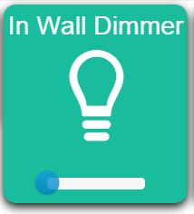

SmartHome por Everspring En Wall Dimmer - AD146-0
================================================

\

-   ** ** El módulo

\

\

-   ** El Jeedom visual **

\

\

resumen
------

\

Esta marca MicroMódulo Wall Dimmer SmartHome Europa
Everspring, está diseñado para controlar el encendido y extinción de
iluminación y equipos eléctricos en su hogar. Puede
también proporcionan una función de atenuación que sólo está
compatible con las bombillas. Con una tensión de 230 V, este módulo puede
apoyo de hasta 300 vatios o carga incandescente resistiva, o 200
Watt fluorescente carga.

Se puede utilizar en el modo 2 hijo (sin neutro), para reemplazar una
interruptor existente, o de tres hilos con una alimentación convencional
módulo (Fase + Neutro).

Wall Dimmer módulo es un dispositivo compatible con Z-Wave ™ es
diseñado para funcionar con todas las redes compatibles con Z-Wave ™. lo
puede ser controlado por un mando a distancia, software PC o cualquier
lo Z-Wave controlador de la red.

\

funciones
---------

\

-   Pide una unidad de iluminación / remoto

-   Se instala detrás de un interruptor existente

-   ON / OFF y regulación

-   Bajo consumo de energía

-   Muy pequeña, de tamaño compacto

-   antena de largo alcance

-   La tecnología Z-Wave Más

-   Se instala fácilmente en una caja empotrada estándar

-   Modo de uso 2 hijo (neutro no es obligatorio)

-   Compatible con bombillas LED regulable

-   Botón para incluir / excluir módulo / asociado

-   función de repetidor Z-Wave

\

Características técnicas
---------------------------

\

-   Tipo de módulo: el receptor Z-Wave

-   Fuente de alimentación: 230 V, 50 Hz

-   Consumo: 0,5 W

-   Potencia máxima:

-   Carga resistiva: 300W

-   bombilla de incandescencia: 300W

-   CFL bombilla: 200W

-   Frecuencia: 868.42 MHz

-   Rango: hasta 70 m en el exterior, hasta 30 m en edificios

-   Pantalla: LED en el botón

-   Dimensiones: 42mm x 43mm x 16mm

\

datos de los módulos
-----------------

\

-   Marca: SmartHome por Everspring

-   Nombre: En Wall Dimmer

-   Identificación del fabricante: 96

-   Tipo de producto: 3

-   Identificación del producto: 2

\

configuración
-------------

\

Para configurar OpenZwave plugin y cómo poner en Jeedom
inclusión se refiere a este
[Documentación] (https://jeedom.fr/doc/documentation/plugins/openzwave/fr_FR/openzwave.html).

\

> ** Importante **
>
> Para poner este modo la inclusión del módulo se debe presionar tres veces en su
> Button, de acuerdo con su documentación en papel. Es importante
> Tenga en cuenta que este módulo se procederá directamente a la inclusión cuando
> No pertenece a ninguna red y es alimentado

\

\

Una vez incluido usted debe conseguir esto:

\

\

### comandos

\

Una vez reconocido el módulo, los comandos asociados con el módulo serán
disponible.

\

\

Estos son los comandos:

\

-   Intensidad: Este es el comando para ajustar la intensidad de la
    luz

-   Uno: Este es el comando para encender la luz

-   Apagado: Este es el comando para apagar la luz

-   Estado: Este es el comando para conocer el estado de la
    luz

\

Una nota sobre el tablero de instrumentos, la información de estado, encendido / apagado, la intensidad
encontrarse en el mismo icono.

\

### Configuración del módulo

\

Se puede configurar la función de su módulo
instalación. Para ello es necesario pasar por el botón "Configuración"
OpenZwave plug-in Jeedom.

\

\

Se llega en esta página (después de hacer clic en la pestaña
configuraciones)

\

\

Detalles de los parámetros:

\

-   1: Este parámetro define el valor de estado de control, no es
    recomendadas para cambiar este valor.

-   2: Este parámetro define el plazo para enviar el cambio de estado
    Grupo 1 (entre 3 y 25 segundos)

-   3: Este ajuste determina si el interruptor se reanudará
    estado (ON u OFF) después de una recuperación de energía.

-   4: Este parámetro define el tipo
    interruptor (push / biestable)

-   5: Este parámetro controla si el interruptor con los cortafuegos
    moda o variación en modo encendido / apagado

### grupos

\

Este módulo tiene 2 grupos de asociación.

\

\

> ** Importante **
>
> Una Jeedom mínimo debería reflejarse en el grupo 1 \

Bueno saber
------------

\

### detalles específicos

\

-   La realimentación de estado no puede ser inferior a 3
    segundos. \

### alternativa visual

\

\

wakeup
------

\

Sin noción de despertador en este módulo.

\

F.A.Q.
------

\

Sí este es el parámetro 2 y no se puede ajustar por debajo de 3
segundos.

\

No. este módulo puede incluir o excluir en varias ocasiones
en el interruptor.

\

** ** @ sarakha63
