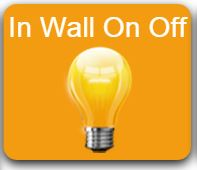

SmartHome por Everspring En la pared en Off - AN179-0
================================================

\

-   ** ** El módulo

\

\

-   **El Jeedom visual**

\

\

resumen
------

\

The Wall MicroMódulo ON / OFF de la marca SmartHome Europa por Everspring,
está diseñado para controlar el encendido y apagado de la iluminación y
aparatos eléctricos en su hogar. Dos juegos de contactos secos
permitir la conexión de dos interruptores.

Por razones de seguridad, la unidad puede detectar el sobrecalentamiento y cerrar
retransmitir directamente para evitar daños. En un 230
V, este módulo puede soportar hasta 11 A por carga resistiva, 1200 Watts
en incandescente motor 700 Watts, 320 Watts o (8 x 40 vatios) de
carga fluorescente.

The Wall MicroMódulo ON / OFF es un dispositivo compatible con Z-Wave ™ es
diseñado para funcionar con todas las redes compatibles con Z-Wave ™. lo
puede ser controlado por un mando a distancia, software PC o cualquier
lo Z-Wave controlador de la red.

\

funciones
---------

\

-   Pide una unidad de iluminación / remoto

-   Se instala detrás de un interruptor existente

-   Encendido / apagado

-   Bajo consumo de energía

-   Muy pequeña, de tamaño compacto

-   antena de largo alcance

-   La tecnología Z-Wave Más

-   Se instala fácilmente en una caja empotrada estándar

-   Botón para incluir / excluir módulo / asociado

-   función de repetidor Z-Wave

\

Características técnicas
---------------------------

\

-   Tipo de módulo: el receptor Z-Wave

-   Fuente de alimentación: 230 V, 50 Hz

-   Consumo: 0,5 W

-   Potencia máxima: carga resistiva: 2500W bombilla de incandescencia
    : 1200W Bombilla CFL: 320W

-   Frecuencia: 868.42 MHz

-   Rango: hasta 70 m en el exterior, hasta 30 m en edificios

-   Pantalla: LED en el botón

-   Dimensiones: 42mm x 43mm x 16mm

\

datos de los módulos
-----------------

\

-   Marca: SmartHome por Everspring

-   Nombre: En la pared en Off

-   Identificación del fabricante: 96

-   Tipo de producto: 4

-   Identificación del producto: 8

\

configuración
-------------

\

Para configurar OpenZwave plugin y cómo poner en Jeedom
inclusión se refiere a este
[Documentación] (https://jeedom.fr/doc/documentation/plugins/openzwave/fr_FR/openzwave.html).

\

> **Importante**
>
> Para poner este modo la inclusión del módulo se debe presionar tres veces en su
> Button, de acuerdo con su documentación en papel. Es importante
> Tenga en cuenta que este módulo se procederá directamente a la inclusión cuando
> No pertenece a ninguna red y es alimentado

\

\

Una vez incluido usted debe conseguir esto:

\

\

### comandos

\

Una vez reconocido el módulo, los comandos asociados con el módulo serán
disponible.

\

\

Estos son los comandos:

\

-   Uno: Este es el comando para encender la luz

-   Apagado: Este es el comando para apagar la luz

-   Estado: Este es el comando que permite conocer el estado de la
    luz

\

Una nota sobre el tablero de instrumentos, la información de estado, ON / OFF se puede encontrar en
el mismo icono.

\

### Configuración del módulo

\

Se puede configurar la función de su módulo
instalación. Para ello es necesario pasar por el botón "Configuración"
OpenZwave plug-in Jeedom.

\

\

Se llega en esta página (después de hacer clic en la pestaña
configuraciones)

\

\

Detalles de los parámetros:

\

-   1: Este parámetro define el valor de estado de control, no es
    recomendadas para cambiar este valor.

-   2: Este parámetro define el plazo para enviar el cambio de estado
    Grupo 1 (entre 3 y 25 segundos)

-   3: Este ajuste determina si el interruptor se reanudará
    estado (ON u OFF) después de una recuperación de energía.

-   4: Este parámetro define el tipo
    interruptor (push / biestable)

### grupos

\

Este módulo tiene 2 grupos de asociación.

\

\

> **Importante**
>
> Una Jeedom mínimo debería reflejarse en el grupo 1 \

Bueno saber
------------

\

### detalles específicos

\

-   La realimentación de estado no puede ser inferior a 3
    segundos. \

### alternativa visual

\

\

despertarse
-------

\

Sin noción de despertador en este módulo.

\

F.A.Q.
------

\

Sí este es el parámetro 2 y no se puede ajustar por debajo de 3
segundos.

\

No. este módulo puede incluir o excluir en varias ocasiones
en el interruptor.

\

** ** @ sarakha63
