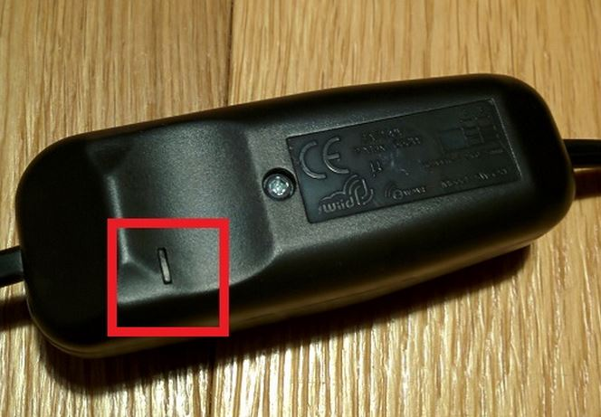

Swiid cambiar - Swiidinter
===============================

\

-   ** ** El módulo

\

\

-   ** El Jeedom visual **

\

\

resumen
------

\

SwiidInter es el primer cable del interruptor en el medio ambiente
Z-Wave domótica que es lo suficientemente pequeño y discreto para estar
comparable a un conmutador de cable ordinario.

Se puede utilizar tanto de forma manual como cualquier
cambiar en el cable plano y de forma remota a través del controlador
Z-Wave.

El interruptor SwiidInter también ofrece posibilidades de asociación
y esto en ambas direcciones. Por lo tanto, puede ser operado automáticamente por un
otro dispositivo Z-Wave de la misma red, tal como la
desencadenar un detector de presencia. A la inversa, con el apoyo
pulsación corta o larga que puede controlar dos grupos separados de
dispositivos Z-Wave que se han asociado con él: por ejemplo, todos
otras luces de la habitación donde se encuentra el conmutador
SwiidInter.

El interruptor SwiidInter mueve exactamente igual que un interruptor
espinal normal: por lo que esta es una instalación rápida y fácil
requiere ninguna herramienta especial. Se debe entonces ser configurado para
ser parte de una "red" Z-Wave, esta red puede ser tan simple
un solo comando de control remoto para cambiar su SwiidInter
la distancia.

\

funciones
---------

\

-   cable del interruptor utilizado tanto de forma manual
    (Corto) y la radio remota (Z-Wave)

-   reemplazo usando un cordón de tracción estándar
    una lámpara de noche, mesa o escritorio

-   Encendido / apagado

-   Habilitación de un escenario domótico de pulsación larga
    (Z-Wave Asociación)

-   Dimensiones comparables a un conmutador de cable ordinario

-   Se instala como un interruptor de cordón ordinaria

-   Adecuado para todos los tipos de bombillas

\

Características técnicas
---------------------------

\

-   Tipo de módulo: el receptor Z-Wave

-   Color: Negro

-   Fuente de alimentación: 230 V ± 10% - 50 Hz

-   Potencia máxima: 660W

-   Consumo: 0,08W &lt;

-   Protección: IP20

-   protocolo de radio: Z-Wave® (SDK 4.55)

-   Radiofrecuencia: 868.42 MHz (UE)

-   Dist. transmisión: hasta 30 m en interiores (dependiendo del material)

-   Temperatura De funcionamiento: 0 - 40 ° C

-   Mostrar On / Off: LEDs azules

-   Dimensiones: 84 x 32 x 29 mm

-   Normas de la UE: EN 61058-2-1: 2011 EN 55015

\

datos de los módulos
-----------------

\

-   Marca: Swiid

-   Nombre: Swiidinter

-   Identificación del fabricante: 358

-   Tipo de producto: 256

-   Identificación del producto: 256

\

configuración
-------------

\

Para configurar OpenZwave plugin y cómo poner en Jeedom
inclusión se refiere a este
[Documentación] (https://jeedom.fr/doc/documentation/plugins/openzwave/fr_FR/openzwave.html).

\

> ** Importante **
>
> Para poner este modo la inclusión del módulo tiene que pulsar el botón
> En la parte posterior, de acuerdo con su documentación en papel

\

\

Una vez incluido usted debe conseguir esto:

\

\

### comandos

\

Una vez reconocido el módulo, los comandos asociados con el módulo serán
disponible.

\

\

Estos son los comandos:

\

-   Estado: Este es el comando para conocer el estado de la
    luz

-   ON: Este es el comando para encender la luz

-   OFF: Este es el comando para apagar la luz

\

Tenga en cuenta que la información completa salpicadero se puede encontrar en la misma
icono

\

### Configuración del módulo

\

Se puede configurar la función de su módulo
instalación. Para ello es necesario pasar por el botón "Configuración"
OpenZwave plug-in Jeedom.

\

\

Se llega en esta página (después de hacer clic en la pestaña
configuraciones)

\

\

Los detalles del parámetro:

\

Este parámetro determina el comportamiento cuando se asocia el
swiidinter a otro módulo (pulsación larga)

\

-   Inactivo: no tendrá ningún efecto sobre otras luces

-   Sólo OFF: sólo será eficaz a poner la otra
    luces

-   Sólo el: será eficaz sólo para poner la otra
    luces

-   ON y OFF (totalmente) será efectiva para el encendido y apagado
    otras luces

\

### grupos

\

Este módulo tiene dos grupos de asociación.

\

\

> ** Importante **
>
> Para un funcionamiento óptimo del módulo. debe Jeedom
> Se asocia con Grupo mínimo 2.

\

Asociado con otro punto de vista
----------------------------

\

Para asociar el swiidinter otro punto de vista y beneficiarse de
encender otra luz, es suficiente con añadir al grupo
Asociación 1 a través de la pantalla se ha mencionado anteriormente.

\

Bueno saber
------------

\

### alternativa visual

\

\

despertarse
-------

\

Sin noción de despertador en este módulo.

\

F.A.Q.
------

\

Cómo se asocian los dos módulos y has configurado el juego
específico.

\

No. El módulo no lo permite.

\

** ** @ sarakha63
