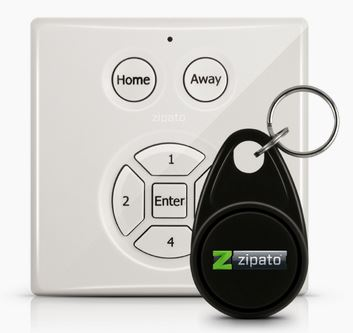
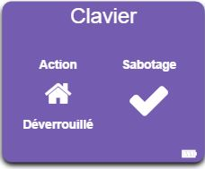

RFID Zipato miniKeypad
======================

\

-   ** ** El módulo

\

\

-   **El Jeedom visual**

\

\

resumen
------

\

Controlar su sistema de seguridad a través de este mini teclado pared Zipato
!

Con este teclado RFID compatibles con Z-Wave, puede activar o
desactivar fácilmente su sistema de alarma. Los botones "Inicio"
"Lejos" permitirá armar / desarmar el sistema de seguridad y / o
ejecutar secuencias de comandos de automatización rápidamente. Además de utilizar la
teclado numérico, también puede pasar una etiqueta RFID en frente de la
teclado para armar / desarmar el sistema. El teclado transmite su
domótica Controller el identificador de la tarjeta de identificación, que ha sido reconocido. Usted
puede crear fácilmente escenarios basados ​​en la persona
que utilizó su tarjeta de identificación.

\

funciones
---------

\

-   código de la llave y RFID

-   Compatible con la tecnología Z-Wave

-   Active / desactive su sistema de seguridad

-   insignias RFID de control de acceso de lectura

-   teclado de código para el control de acceso

-   protección contra la manipulación

-   indicador LED para confirmar cada acción

-   zumbador integrado para la indicación audible de armado / desarmado
    por ejemplo alarma

\

Características técnicas
---------------------------

\

-   Tipo: esclavo Z-Wave

-   Fuente de alimentación: 2 pilas AA de 1,5 V

-   Frecuencia: 868.42 MHz

-   Radio Rango: 30m en campo abierto

-   Protocolo de RFID: ISO15693, ISO18000-3, Tag-it ™, la tecnología RFID

-   Zumbador: 60dBA a 10 cm de distancia

-   Temperatura de almacenamiento: -5 ° C a + 65 ° C

-   Humedad de almacenamiento: 10% a 70%

-   Temperatura de funcionamiento: 10 ° C a 40 ° C

-   Humedad de funcionamiento: 30% a 80%

-   Dimensiones: 62 x 62 x 20 mm

-   Certificaciones: Seguridad: UL EMC: FCC, CE RoHS

\

datos de los módulos
-----------------

\

-   Marca: Zipato

-   Nombre: Zipato Mini teclado RFID

-   Identificación del fabricante: 151

-   Tipo de producto: 24881

-   Identificación del producto: 17665

\

configuración
-------------

\

Para configurar OpenZwave plugin y cómo poner en Jeedom
inclusión se refiere a este
[Documentación] (https://jeedom.fr/doc/documentation/plugins/openzwave/fr_FR/openzwave.html).

\

> **Importante**
>
> Para poner este modo la inclusión del módulo sólo tiene que pulsar dos
> segundos en la lengua de metal (el LED rojo en el panel frontal
> Debe parpadear dos veces) y suelte la lengüeta de manera que
> Inclusión ocurre.

\

\

Una vez incluido usted debe conseguir esto:

\

\

### comandos

\

Una vez reconocido el módulo, los comandos asociados con el módulo serán
disponible.

\

\

Estos son los comandos:

\

-   Acción: Este es el comando para ascender el hogar / lejos (de 5 a 6 de distancia
    para el hogar)

-   Sabotaje: el comando de sabotaje (que se dispara
    Si lagrimeo)

-   Código: Muestra el código de la tarjeta de identificación o el teclado cuando el código introducido
    no está en una de las memorias

-   Batería: el control de la batería

\

### Configuración del módulo

\

> **Importante**
>
> Cuando inclusión por primera vez todavía despierta en el módulo justo después de
> Inclusión.

\

Entonces, si desea configurar el módulo de acuerdo
su instalación, para ello es necesario pasar por el botón
"Configuración" plug-in OpenZwave Jeedom.

\

\

Se llega en esta página (después de hacer clic en la pestaña
Configuraciones)

\

\

Detalles de los parámetros:

\

-   1: restablece la configuración por defecto (no se recomienda)

-   2: Duración Cancelado (no cambiar)

-   3: el retorno de los pitidos: habilita o no una serie de pitidos 8
    tras el reconocimiento de una tarjeta de identificación / código

-   4: número de pitidos por segundo (sin cambio no tiene ningún efecto)

-   5: Modo de funcionamiento: normal o la moda todavía está despierto
    (No se recomienda para las baterías de consumo muy muy)

\

### grupos

\

Este módulo tiene dos grupos de asociación.

\

\

> **Importante**
>
> Para un funcionamiento óptimo del módulo. debe Jeedom
> Se asocia con un mínimo o el grupo 1.

### Las insignias / códigos

\

En el equipo hay una pestaña Asistente.

\

\

Esto le permite añadir código. Verá una imagen.

\

\

-   Esta tabla le permite ver sus recuerdos ocupados
    teclado

-   Para guardar un nuevo código haga clic en el botón verde del
    deseada memoria y siga los pasos

-   Para borrar un código, simplemente haga clic en el botón rojo.

-   Es imposible grabar el mismo código / tarjeta de identificación en dos memorias
    diferente

-   Es imposible (por razones de seguridad) para leer el valor de una
    código grabado

\

> **Importante**
>
> Piense en despertar el módulo con la adición de un código o tarjeta de identificación.

\

Ejemplos de uso
----------------------

\

\

El evento de disparo es el control, de hecho, es
actualiza sólo cuando se presenta un código válido / insignia. Si la
valor es 6 (home) la desactivación de la alarma (por ejemplo), o se enciende el
tira, se enciende la luz de acuerdo con el brillo, envía
notificación para indicar que alguien está en casa, lanzamos una
synhtèse voz a un informe del tiempo, por ejemplo. Si no (necesariamente
5) la activación de la alarma, se corta la tira, se alimenta una
notificación que indica que la casa está vacía.

\

Bueno saber
------------

\

### detalles específicos

\

El teclado lee códigos / insignias de dos maneras:

\

-   cuando se pulsa el hogar / lejos durante la primera del 1 al 2
    segundos si comienza a escribir un código, se leerá el código

-   si no se hace nada en los primeros 1 a 2 segundos, se inicia
    el modo de reproducción insignia RFID (luz roja). En ese momento
    se puede leer una tarjeta de identificación, no antes.

\

wakeup
------

\

Para despertar este módulo hay dos maneras de proceder:

\

-   pulse el botón de manipulación y liberación después de 1 a 2 segundos

-   pulse Inicio, un número aleatorio y Enter

\

F.A.Q.
------

\

Este módulo se despierta pulsando el botón y el tamper
la liberación. También puede despertar pulsando Inicio y luego 1
Enter.

\

Este módulo es un módulo de batería, la nueva configuración se
consideración en la próxima activación.

\

Nota importante
---------------

\

> **Importante**
>
> Hay que despertar el módulo después de su inclusión, después de un cambio
> Configuración, después de un cambio de despertar después de una
> Asociación cambiar de grupo

\

** ** @ sarakha63
